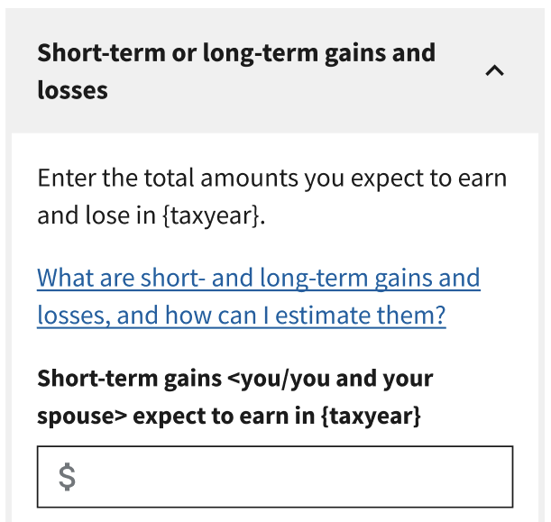
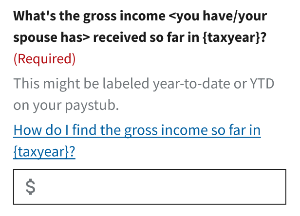

# TWE Content Guidelines

Use the content guidelines to ensure TWE content is clear, consistent, and usable.

To help guide content decisions, you can also refer to the TWE Design & Content Principles (available at a later date).

_Disclaimer: TWE content guidelines are iterative and there is still work needed to fully implement them in TWE._

1. [Content principles](#content-principles)
1. [Voice and tone](#voice-and-tone)
1. [Plain language](#plain-language)
1. [General grammar and mechanics](#general-grammar-and-mechanics)
1. [Headings](#headings)
1. [Page titles](#page-titles)
1. [Lists](#lists)
1. [Abbreviations and acronyms](#abbreviations-and-acronyms)
1. [IRS form names](#irs-form-names)
1. [Fields and inputs](#fields-and-inputs)
1. [Button text](#button-text)
1. [External links](#external-links)
1. [Help modals](#help-modals)
1. [The word "estimate"](#the-word-estimate)
1. [Word list](#word-list)
1. [Content structure](#content-structure)
1. [Spanish-specific general guidelines](#spanish-specific-general-guidelines)
1. [Appendix: TWE Content Guidelines formatting](#appendix-twe-content-guidelines-formatting)

## Content principles

These six principles guide all content decisions in TWE. The rest of the guidelines are how we apply them.

### Keep it tight

Using the estimator shouldn't feel like doing taxes. Concise, scannable content lets taxpayers stay focused and make fewer mistakes. Write short and clear by default; offer thorough explanation only when it's needed.

### Be a supportive guide

Know the tax material and withholding calculations and explain them in plain language. Don't assume that taxpayers are tax literate and teach them the terms they need to know. Don't apologize for the complexity of tax and don't lecture taxpayers about the "right" choice.

### Write for every taxpayer

A wide range of people use TWE: wage earners, retirees, self-employed, joint and single filers, screen reader users, people reading in Spanish, and more. Every next step, instruction, and field label should work for all of them.

### Get the tax right

Tax accuracy is where being slightly off has real consequences. Base content on IRS publications, preserve technical terms like "estimated tax payments" and "withholding," and pause before simplifying anything that carries weight.

### Be consistent with purpose

Use the same terms, labels, and patterns everywhere so taxpayers can recognize signposts. Pick a word and stick with it. Mirror modal titles to their parent links and match cross-screen phrasing.

### Ground decisions in research

When taxpayers tell us something doesn't work, listen. Research findings shape editorial decisions, not just design ones. "Total" became "combined" because research showed it signals taxpayers to sum things. When a pattern isn't tested, say so.

## Voice and tone

Voice and tone follow from the [Content principles](#content-principles). These rules shape how TWE sounds across every screen, modal, and message.

* Aim for "business casual": direct and authoritative, yet friendly, empathetic, trustworthy, and helpful.
* Be a supportive guide, not an authority figure. Taxpayers may need help, so explain concepts without assuming the reader should already know them, and don't apologize for the complexity of tax itself.
* Respect taxpayers' judgment. They're handling real financial decisions and bringing real questions. Don't hedge, lecture, or moralize about the "right" choice.
* Be direct, not deferential or commanding. "Please" makes TWE sound deferential; "must" makes it sound bossy. Direct phrasing keeps the exchange level. Refer to the Word list entries for [Please, sorry](#please-sorry) and [Must](#must).
* Use contractions to keep the voice conversational. Spell out the full form for emphasis when needed.
* Avoid exclamation points.

## Plain language

Plain language is how we apply our "keep it tight" content principle. Most taxpayers come to TWE because something changed in their life: a new job, a marriage, retirement. Their attention is split. Plain language meets them where they are.

Some taxpayers handle their own taxes every year and know what a 1099-R is. Others are filing for the first time. Aim for clear enough for the newcomer, not condescending to anyone else.

* Lead with what the taxpayer needs to do. If you're asking them to enter a number, say "Enter the amount" first; don't bury it under setup.
* Write short sentences. If one runs past about 20 words, look for a place to break it.
* Use active voice. "Enter your wages" reads more directly than "Wages should be entered."
* Cut unnecessary words. Modifiers like "really," "very," and "totally" rarely add meaning. Same with doublets: "due and payable" can be "due."
* Pick a word and stick with it. If you call something a "paystub" once, call it a "paystub" everywhere. The [Word list](#word-list) is the source of truth.
* Avoid jargon, but keep necessary technical terms. "Withholding," "dependent," and "1099" can't be replaced. Don't combine technical terms if one is enough.
* Define technical terms where they appear so readers don't have to scroll somewhere else to understand a field label.
* Use the entry-point pattern when a term appears at multiple UI levels. Lead with plain language at the entry point (field label or modal heading) and define the technical term in the explanation (modal body):
  * Modal heading (entry point): "What are your gross wages for the most recent pay period?"
  * Modal body (defines the term): "Your gross wages are the amount you expect to be paid in {taxyear}, before any taxes or deductions are taken out."

When you've written something, read it out loud. Show it to someone who hasn't been deep in the tax content with you. If it stumbles, revise.

For more, refer to [digital.gov's Plain Language Guide](https://digital.gov/guides/plain-language).

## General grammar and mechanics

* Use sentence case (capitalize only the first word) for all section navigation elements, headings, subheadings, and button text (except for proper nouns).
* Use contractions like *What's* instead of *What is*, because they tend to be simpler to read and reduce cognitive load.
* Use serial commas (Oxford comma).
* Periods and commas always go within single and double quotation marks.
* Tenses will vary. Sometimes it makes sense to use past, present, and even future.
  * A past action that impacts future deductions: "If you withdrew funds prematurely you may have been penalized... and you can deduct the penalty."
  * A state of being that impacts future deductions: "If you're divorced or separated... you can deduct."
* Use en dashes (–), not hyphens (-), for number ranges including dollar amounts and dates. This is standard typographic convention.

  | Before | After |
  | :--- | :--- |
  | $40,000-$50,000 | $40,000–$50,000 |

## Headings

* Use headings to give structure to pages. Headings should be descriptive, consistent, and properly nested, as you would if you mapped the contents of the page as an outline (H1–H4).
* **Don't** use links in a heading.
* **Tip:** If you could navigate this page using only the headings, could you easily find key information?
* Avoid questions in subheadings; use "What it is," not "What is it?"

## Page titles
The page title is the text set in the HTML `<title>` tag for each page. It doesn't show in the body, but taxpayers see it in three places: the browser tab, search results, and screen readers (which announce it first when a page loads). Each TWE step is its own page with its own web address (URL), so each needs its own title.

Lead with the step, then the tool, then the agency.
* Put the step first. Browser tabs and search results cut off the end of long titles, so the part that identifies the page has to come first.
* Match the step name to the page's main heading (H1): if the heading reads "About you," the title starts with "About you."
* Separate the step from the tool with a hyphen, and the tool from the agency with a vertical bar (|).
* Use sentence case for the step name. Keep "Tax Withholding Estimator" and "Internal Revenue Service" capitalized as proper names.
* Base the title on the step, not the taxpayer's answers or result. The Results step stays "Results" whether they're over- or under-withholding.
* Keep the landing page title as the tool name alone; there, the tool is the most specific identifier.

| Page | Title |
| :--- | :--- |
| Landing page | Tax Withholding Estimator \| Internal Revenue Service |
| About you (step) | About you - Tax Withholding Estimator \| Internal Revenue Service |
| Income (step) | Income - Tax Withholding Estimator \| Internal Revenue Service |
| Results (step) | Results - Tax Withholding Estimator \| Internal Revenue Service |

## Lists

* Use lists to help make complex information more digestible and avoid long paragraphs of text.
* If there's only one item, write it as a sentence. A single bullet isn't a list. Combining it into the preceding or following sentence is usually the cleanest fix.
* Use a numbered list only when sequence matters (e.g., steps a taxpayer should follow in order). For independent items where order doesn't matter, use bullets.
* Use a colon after the text introducing a list.
* Capitalize the first word of each bullet.
* Don't use end punctuation for list items.
  * If you have complex information that needs more than one sentence in a bullet, try adding the extra information under the bullet as a full sentence
  * If you have a situation that really demands end punctuation for a list item, it's okay to break this rule but be sure to break it consistently within that screen or modal
* Start each item with the same language element (verb, noun, adjective). If the list suggests an action, start each item with a verb.
* If needed, you can include "and" or "or" at the end of a list item to reiterate the logic of the list:

  > To claim the foreign tax credit, you or your spouse need to:
  > * Pay or owe taxes to a foreign country or U.S. territory, and
  > * Be subject to U.S. tax on the same income

* Use lists for independent items:

  > You'll need to have these materials ready:
  > * Your paystub
  > * Your {taxyear-1} federal tax return
  > * Your Adjusted Gross Income (AGI) from {taxyear-1}

* Use lists to describe different possible qualities of a thing:

  > You can deduct expenses that are:
  > * Common and accepted in your field of trade, business, or profession
  > * Helpful and appropriate for your business

## Abbreviations and acronyms

* Spell out uncommon abbreviations in all titles, headings, form labels, and links; otherwise, spell them out on first reference per page.
* Once the full spelling + abbreviation is established, use the abbreviation throughout the rest of that screen.
* We apply this guideline to screens, help modals, and alerts. When the taxpayer is shown a new piece of content (a screen, a modal, or an alert), reestablish the abbreviation.
* **Acronyms** are abbreviations that you pronounce as a word (e.g., UNESCO, NATO).
* **Initialisms** are abbreviations where you pronounce each letter when you read it (e.g., PTC, IRS). Commonly recognized acronyms and initialisms (like IRS) do not need to be spelled out.
* Use an article ("the" or "a/an") before initialisms when using them as a noun or modifier (e.g., "Did you get the CDCC last year?").
* Use "a" before an acronym or initialism that starts with a consonant sound.
* Use "an" for an acronym or initialism that starts with a vowel sound (e.g., "Did you have an HSA?").

### Abbreviation exceptions

* **COBRA**: Never spell out this abbreviation. Most taxpayers are more familiar with COBRA and less familiar with the spelled-out version "Consolidated Omnibus Budget Reconciliation Act." The full spelling may create confusion.
* **IRA**: Don't spell out IRA. The acronym is more recognizable than "individual retirement arrangement," and spelling it out can create confusion. This is one place where using the acronym is plain language. Applies equally to compound forms like SIMPLE IRA, where spelling out either part would make the term long and hard to scan.

## IRS form names

* Say: "Form W-2," "Form 1099-G," etc. Not: "W-2 form," "1099-G form," etc.
* For multiple copies of a form, use "Forms W-2" or "Forms W-2 and W-3."
* To reference parts of a form, use the Form, part, and line separated by commas. Match the language shown on the form itself. For example: Form 2441, part II, line 2.

## Fields and inputs

This section covers content patterns for input fields, including how to phrase questions and labels, when and how to mark fields optional, error and caution messaging, and conditional hints.

### Questions and field labels

* Avoid adding extra intro phrases and words like "Enter the total amount of…"
* Always specify &lt;you/you and your spouse&gt; so taxpayers know exactly what value we're looking for.
* Be as specific as possible, assuming some taxpayers may skip all of the screen content and just read the field labels before entering a number.
* Use the {taxyear} placeholder ({taxyear}/{taxyear-1}/{taxyear+1}) because it's more specific than saying "this year" or "last year" and prevents errors. You can also use a variation of "so far this year" to guide the taxpayer.
* Use verb forms like "expect to earn" or "think you'll earn" to indicate the amount is approximate.
* Avoid "estimated" as a modifier in field labels. Refer to [The word "estimate"](#the-word-estimate).

We **tell** taxpayers what input to add (number, totals, info, estimates, etc.):

* Enter amount of other income &lt;you/you and your spouse&gt; expect to receive in {taxyear}
* Enter federal taxes withheld from &lt;your/you and your spouse's&gt; other income so far in {taxyear}

We **ask** taxpayers when there are options to choose from:

* Who is this income for? (Options: Me, My spouse)
* Is this an hourly or salary job? (Options: Hourly, Salary)
* What's the first day in {taxyear} &lt;you/they&gt; expect to have this job? (Options: Date input)
* How frequently are &lt;you/they&gt; paid? (Options: Weekly, Every two weeks, etc.)

### Optional-field messaging by field type

Don't use "It's okay to leave this blank" uniformly across all optional fields. Different field types need different messaging to maintain trust and protect the estimate's accuracy.

* **Fields that may not apply** (e.g., tips for non-tipped workers): Use a single section-level intro: "If this doesn't apply to you, it's okay to leave these blank."
* **Fields that help accuracy but are hard to find** (e.g., contributions): Lead with motivation: "Adding this will make your estimate more accurate." Use "You can estimate or leave this blank" as the safety valve, not the lead.
* **Fields gated by a specific condition** (e.g., SSN requirement): Handle the condition separately, in a help modal or a dedicated hint, rather than as another instance of "okay to skip."
* Repeating the skip message on every field undermines the design principle of protecting taxpayers from underwithholding, and risks signaling that the fields don't matter.

### Field validation errors

* Field validation errors are the red error messages that show when someone leaves a required field blank or inputs an invalid answer (like a year with 2 digits instead of 4).
* Before writing a new validation error, always check for an existing error first.
* Use non-blaming language: "Your device isn't online" instead of "You aren't online."
* Focus on how to fix the problem, not just what went wrong.
* Start the error with a verb if possible, like "enter."
* Punctuate all validation error text.
* Avoid words like "please," "must," and "sorry."

### Cautions

When **cautioning** taxpayers in help text, frame the message as a consequence rather than a prohibition. Don't use "Avoid doing X" constructions. "Avoid" reads as a mild scold; stating the consequence is neutral and lets the taxpayer make an informed choice.

| Before | After |
| :--- | :--- |
| "Avoid entering a higher amount than you're sure of." | "Entering a higher amount than you're sure of can make your estimate less accurate." |

### Conditional hint text

When hint text includes a conditional instruction, lead with the condition ("If you don't have...") rather than the action ("Leave this blank if..."). This lets taxpayers who don't match the condition skip the sentence immediately.

| Before | After |
| :--- | :--- |
| "Leave this blank if you don't have a Social Security number." | "If you don't have a Social Security number, leave this blank." |

### "If you don't know" messaging

General observations from research showed that when participants were asked to input $0 or leave blank (fields that don't apply), the most common behavior was leaving the field blank. Engineering confirmed there is no difference if they add $0 or leave blank, so avoid asking the taxpayer to input $0.

| Before | After |
| :--- | :--- |
| "If you're not sure, it's okay to enter $0." | "If you're not sure, leave this blank." |

Use one of the following, depending on the situation:

* **When the taxpayer may not know the answer**: "If you're not sure, leave this blank."
* **When the taxpayer can estimate**: "It's okay to estimate."
* **When the field may not apply**: "It's okay to leave this blank." (Refer to [Optional-field messaging by field type](#optional-field-messaging-by-field-type).).

## Button text

* Use imperative or neutral verb forms for buttons; they are shorter and scan faster.
* First person is unusual for button text and inconsistent with TWE's interface.
* For CTAs, lead with an action verb: "Start your estimate" rather than restating the page title.
* Avoid first-person constructions like "I'm done."

  | Before | After |
  | :--- | :--- |
  | "I'm done" | "Done" |

* Label the forward button "Next" on every step except the last, where the label names the outcome ("Get your results")
* Provide "Back" in both places it appears: as a link near the top of the page and as the secondary button at the bottom of the page, paired with the primary forward button

## External links

* Link to IRS or other government pages to provide more information or context that taxpayers may need but won't fit into a help modal.
* External links should be used as a last resort. If you can give taxpayers the information they need in TWE, do so instead of sending them to separate windows, which can be difficult to navigate between.

### Choosing link destinations

* Link to information that's most relevant to what taxpayers need to know about a particular circumstance or topic. For example, if they want to know about standard deductions, don't link them to a page about standard and itemized deductions.
* Use the page with the most available translations. If two pages are equally relevant, but one is available in 2 languages and the other is available in 7, pick the latter.
* Prioritize using pages that were updated or reviewed in the last 6 months (the date will be at the bottom left or top left of the screen).
* Link to helpful publications and form instructions.
  * For publication links, use the HTML version (not the PDF) and use navigational headings to point directly to an anchor for the information on a page, instead of starting someone at the top and making them scroll down to find it.
  * If a PDF has a landing page with more information, link there instead of directly to a PDF. Only link directly to a PDF if absolutely necessary.
* Avoid linking to IRS Newsroom pages; they're updated and reviewed less frequently than Tax Topics pages
* Avoid linking to Interactive Tax Assistant (ITA) pages because you may be sending people to an experience that doesn't apply to their tax situation

**Note**: IRS links may need to be checked and updated annually (you can tell when there's a YEAR in the url).

### External link anchor text

* Start with "Learn more…" and avoid unnecessary link text, such as "Click here for more" or "For more, refer to [link]."

| Before | After |
| :--- | :--- |
| Click [here](https://www.irs.gov/credits-deductions/individuals/earned-income-tax-credit-eitc) for more information on the EITC. | [Learn more about the EITC](https://www.irs.gov/credits-deductions/individuals/earned-income-tax-credit-eitc). |

* Match the link content to the destination content as closely as possible, while maintaining TWE's plain language.
* Balance link specificity and brevity. Always add punctuation to the end of link anchor text (`.` or `?`).

| Before | After |
| :--- | :--- |
| [Learn more about the specific 2024 tax guidelines for independent contractors working in the US](https://www.irs.gov/businesses/small-businesses-self-employed/independent-contractor-defined). | [Learn more about contractor tax guidelines](https://www.irs.gov/businesses/small-businesses-self-employed/independent-contractor-defined). |

* In a "learn more" style sentence, if there's one link, link the entire sentence. If there are two or more links, link only the specific anchor text.

| Before | After |
| :--- | :--- |
| Learn more about the [Child Tax Credit](https://www.irs.gov/credits-deductions/individuals/child-tax-credit). | [Learn more about the Child Tax Credit](https://www.irs.gov/credits-deductions/individuals/child-tax-credit). |
| [Learn more about the Child Tax Credit](https://www.irs.gov/credits-deductions/individuals/child-tax-credit) and the [Education Credits](https://www.irs.gov/credits-deductions/individuals/education-credits-aotc-and-llc). | Learn more about the [Child Tax Credit](https://www.irs.gov/credits-deductions/individuals/child-tax-credit) and the [Education Credits](https://www.irs.gov/credits-deductions/individuals/education-credits-aotc-and-llc). |

* Use the external link icon (↗️) for **all** non-TWE links (e.g., IRS.gov, SSA.gov, Healthcare.gov) to differentiate them from internal TWE modals

| Before | After |
| :--- | :--- |
| What is a [Form W-4](https://www.irs.gov/forms-pubs/about-form-w-4)? | [What's a Form W-4? ↗️](https://www.irs.gov/forms-pubs/about-form-w-4) |

## Help modals

### Help modal links

* If a help modal is specific to a single input, place it between the question and the input field.
* Place links to help modals **above** any input fields they assist with.

  


* Don't include help modal links in a heading that's used to structure content.
* Unlike external links, help modal links always link the full sentence, even when there's more than one. Help modals are typically the only link in a question or hint, so the additional specificity isn't needed.
* Always add punctuation to the end of link anchor text ("." or "?").
* It's okay to use an acronym or abbreviation like SSN or CTC in link modal anchor text, but be sure to spell the word out fully again in the link modal heading itself.
* Whenever possible, phrase help modal links as questions.

  > "How do I check if there's a bonus this pay period?"

* When helping taxpayers look something up on a paystub or form, you can use a "How do I find it?" construction:

  > "How do I find gross income so far this year?"

* Use the following styles for modal link text and main heading:
  * What is ______ and how do I ______ (verb: claim, estimate, etc.)?
  * What counts as _____ (noun, program name, type of income, etc.)?

### Help modal content

Help modals follow a consistent internal structure:

1. **Heading**: a user-voiced question that restates the link text, with any abbreviation from the link spelled out fully.
2. **Body**: for definition modals, lead each term in bold followed by a plain-language definition. Name the related tax form when it helps taxpayers connect the concept to their paperwork ("At the end of the year, you'll receive a Form SSA-1099").
3. **Lists**: use bulleted lists for what counts or doesn't count toward an amount. Refer to [Lists](#lists).
4. **Closing external link** (optional): a "Learn more about…" link with the external link icon, when taxpayers may need depth that doesn't fit the modal. Refer to [External links](#external-links).

One standing decision applies across all help modals:

* **Decision**: Use "your" in all help modals. Don't vary it between "your" and "their" for spouse-related content.
* **Why**:
  * It's simpler for design and engineering to manage a single variation of modal content. Varying dynamic text for primary ("your") and spouse ("their") would require additional logic and UX writing.
  * It's usually one person using TWE and reading the help modals. That person should be able to apply the content to a spouse when needed.

## The word "estimate"

### Instructions and action prompts

**Use "enter" as the primary action verb, not "estimate."** The "expect to" phrasing in the field label signals the value is approximate.

| Before | After |
| :--- | :--- |
| Estimate any other taxable income you think you'll receive | Enter any other taxable income you expect to receive |

### Field labels

**Avoid "estimated" as a modifier.** It adds length without value. Use "expect to earn/receive" instead, which reinforces approximation in a more natural way.

| Before | After |
| :--- | :--- |
| Total estimated bonus pay for {taxyear} | Bonus pay you expect to earn in {taxyear} |

### Hint text

**"Estimate" is fine as a noun or verb when giving taxpayers permission to approximate.** Keep the tone neutral rather than encouraging. Don't nudge taxpayers toward estimating over leaving a field blank, especially for fields where overestimation could cause underwithholding (tips, overtime, pre-tax contributions).

| Before | After |
| :--- | :--- |
| If you don't know, leave this blank. | It's okay to estimate or leave this blank. |

**Avoid:** "Even a rough estimate can improve your results." This nudges toward overestimation, which can cause underwithholding.

For fields the taxpayer may genuinely not know the answer to, rather than estimate, refer to ["If you don't know" messaging](#if-you-dont-know-messaging).

### Help modal headings

**Prefer plain language over "estimate" when possible.** Taxpayers open modals because they need help. Leading with everyday language is more approachable.

| Before | After |
| :--- | :--- |
| How do I estimate total gross wages for this job? | How much will I be paid at this job in {taxyear}? |

### Help modal body text

**"Estimate" is fine as a verb describing the taxpayer's task.** This is explanatory context where the word is natural and useful.

* "To estimate the tips you'll receive in {taxyear}:"
* "If it's hard to estimate, it's okay to enter only what you've received so far."

### Describing the estimator's output

**Avoid "estimated" when describing results.** Taxpayers may read it as uncertain or unreliable. Use "your results" or describe the specific output.

| Before | After |
| :--- | :--- |
| Your estimated withholding amount | Your results |

### Quick reference

| Context | Use "estimate"? | Instead use |
| :--- | :--- | :--- |
| Field labels | No | "X you expect to earn/receive in {taxyear}" |
| Action instructions | No | "Enter" |
| Hint text | Yes, neutrally | "It's okay to estimate or leave this blank" |
| Modal headings | Avoid if possible | Plain language question |
| Modal body | Yes | Natural usage as verb or noun |
| Describing output | No | "Your results" or specific description |

## Word list

Entries with a **bold first line** are words or constructions to stay away from. The rest are usage guidance.

### Above, below

* **Avoid directional language, e.g., "The question below…"**
* Use "previous question," "next question," or similar terms instead

### Can vs. may

* If we know it to be true, then we should write it like it's true: "*can*."
* If we don't know, then we should lean toward language like "*may*."
* For credits with complex requirements, "may" is okay.

  > You **may** get up to $1,000 per child if they're under 17 in {taxyear}, lived with you most of the year, and have a valid Social Security number.

  > If you paid for medical and dental expenses or premiums, you **can** only deduct the amount of your expenses over &lt;$XXX&gt;.

* **Spanish**: puedes, podrías

### Choose, enter, select

* Use the words "enter" and "choose" to talk about the action of inputting or answering a question.
* In gray hint text and form instructions, use the more authoritative "Select" when giving a directive about a specific UI action. Two common cases:
  * Pointing to a specific option: "Select 'No' if you don't have a Social Security number."
  * Indicating a multi-select interaction: "Select all that apply."

### Click, tap

* **Avoid "click" or "tap."**
* Use "choose" or "select" instead

### Estimate, estimated

Refer to [The word "estimate"](#the-word-estimate).

### Federal tax vs. federal taxes

On IRS.gov, the difference between federal tax and federal taxes comes down to basic English grammar rather than a distinct legal or technical definition. The IRS uses them interchangeably depending on whether the term is acting as a descriptive adjective, a singular concept, or a plural noun. Currently, we are also using them interchangeably.

**Choosing between the two:**

* Use **federal taxes** if the phrase needs a **noun** to describe the collective money or duties owed
* Use **federal tax** if the phrase is **describing a specific noun** (like a return, bracket, refund, or form)

### Federal tax return

Say "federal tax return" on first mention on a screen or modal; after that, say "tax return."

### Filing status

* Capitalize filing status names (e.g., Head of Household).
* When referring to how a person is filing, say the person is **using** the filing status and capitalize the filing status name. E.g., "If you're using Married Filing Separately…"
* You can also refer to filing statuses more organically by saying: "If you're filing a joint federal tax return" or "If you're married and filing separately from your spouse…"
* **Spanish**: Only initial caps (e.g., Casado que presenta una declaración conjunta).

### Gross

* If you need to include the word "gross" in a question to describe an amount, always include a hint or modal that helps explain what "gross" means.
* Gross may not be a commonly understood term for all taxpayers, so it's helpful to explain it as the total amount before taxes or deductions are taken out.
* **Spanish**: ingreso bruto, sueldo bruto, etc.

### Have vs. receive (for income and benefits)

* Use **receive** when referring to income someone is or will be getting.
* Reserve **have** for possession or account-level questions. **Have** is ambiguous for income; someone can "have" Social Security benefits in the sense of being eligible without actually getting payments yet.
  * Receive: "Do you receive Social Security payments?" "Pension income you expect to receive in {taxyear}."
  * Have: "Did you have an HSA?" "Do you have a Social Security number?"
* **Spanish**: recibir, recibes; tener, tienes

### Health Savings Account (HSA), Flexible Spending Account (FSA)

* To be consistent with IRS.gov and Healthcare.gov style, always capitalize these and include the acronyms on the first mention.
* All other mentions can use the acronyms only.
* **Spanish**: Cuenta de ahorros para la salud (HSA), Cuenta de gastos flexibles (FSA).

### Itemize, itemized

* If used as an **adjective** (to describe something), say "itemized."
* If used as a **verb** (to describe an action) for the taxpayer, say "itemize."
  * "Choose if you want to use itemized deductions…"
  * "If you choose to itemize deductions…"
* **Spanish**: detallar, detallados

### Look, see

* **Avoid language that only applies to sighted users (e.g., "see," "view").**
* Use "check," "review," or similar terms instead.
* **Spanish**: Use revisa, consulta, verifica, etc.

### Must

* **Avoid "must." For example, "You must enter the amount…"**
* Lead with verbs when giving instructions (e.g., "Enter the amount…")
* **Spanish**: Avoid "…debes ingresar la cantidad/el monto." Use "…ingresa la cantidad…"

### My, your

* **Avoid or limit adding possessive pronouns to buttons and labels unless they provide helpful context.**
* If you need to add a possessive pronoun, then avoid "my" and only use "your" or "their."

### Net

* Only use the word "net" if it's specifically needed. For example, we need to use "net" to describe rental income, because TWE is looking for the total of rental income, minus expenses, aka "net."
* If you use "net," include a hint or modal explaining what it means because it may not be common terminology to all taxpayers.

### Okay

* Use **okay** consistently. Avoid "ok" and "OK." "Okay" is more readable and feels less informal than "ok."
* **Spanish**: Don't use okay/ok/OK. Use "Puedes…" constructions instead. Refer to [Spanish-specific general guidelines](#spanish-specific-general-guidelines).

### Paystub, paycheck

* **Paycheck**: Use when referring to amounts paid because this is the check or payment you get for hours worked.
* **Paystub**: Use this when referring to the additional information about a paycheck. A paystub summarizes all the amounts contained within a paycheck, such as withholdings, state tax, federal tax, gross pay, etc.
* **Spanish**: talón de cheque de pago, cheque de pago.

### Please, sorry

* **Avoid "sorry" and "please" in warnings and errors.**

### S-corporation

* Hyphenate S-corporation to improve readability. This differs from the irs.gov spelling of "S corporation."
* **Spanish**: corporación S

### Self-employment, self employed

* Hyphenate **self-employment** when using it as an **adjective**: "You need to pay self-employment tax."
* Don't hyphenate **self employment** when using it as a two-word **noun**: "Income from self employment…"
* **Spanish**: trabajas por cuenta propia, por encargo (gig worker).

### Social Security

Social Security is always capitalized when modifying other words (e.g., "Social Security payment").

### Social Security number (SSN)

Leave the word "number" in lowercase to be consistent with IRS and SSA style.

### Step

* Refer to sections of TWE as "steps" and not "pages" or "screens."

  > "Enter this information in the Adjustments step."

* When referring to "Results" you could use either "step" or "page" because it's the last part of TWE and "page" may sound more natural.

### Tax Withholding Estimator

* Avoid using the full name of the tool "Tax Withholding Estimator" in the designs.
* If you need to refer to TWE in the designs, say: "the estimator."
* Use lowercase because "estimator" is not a proper noun.
* Avoid calling TWE a "tool" in the design.

### Tax year

Use {taxyear} when the reference points to a particular calendar year, typically the year the taxpayer is estimating for or a value tied to that year. Use "year" when describing a recurring annual process or event that happens the same way every year.

**Specific years (use {taxyear}/{taxyear-1}/{taxyear+1}):**

* "Income you expect to earn in {taxyear}"
* "Your {taxyear} federal taxes"
* "Check your {taxyear-1} federal tax return"

Replace generic year references with the {taxyear} placeholder:

| Before | After |
| :--- | :--- |
| "If you earned any additional pay this year" | "If you earned any additional pay in {taxyear}" |

**General years (use "year"):**

* "At the end of the year, your employer sends a Form W-2 to report this income."
* "Your employer sends you a Form W-2 every year."

**Exception**: "So far in {taxyear}" is the preferred form when the question refers to amounts accumulated through the current date.

### This year, last year

Refer to [Tax year](#tax-year).

### Tool

Refer to [Tax Withholding Estimator](#tax-withholding-estimator).

### Total

* **Avoid "total" when talking about amounts (unless it's for specific emphasis like adding together multiple amounts).**.
* Limit the use of this word to reduce cognitive load and question length, and give it more impact when needed.
* User research showed that "total" signals to taxpayers that they're being asked to sum up multiple things. "Combined" conveys the same meaning without that signal.
* When you need to communicate the sum of multiple amounts, use "combined" instead of "total."

  | Before | After |
  | :--- | :--- |
  | "The total withheld from both paychecks" | "The amount withheld from both paychecks combined" or "the combined withholding" |

### Wages vs. income vs. pay

Use "gross wages" in field labels (matches paystub language), "pay" in plain-language headings and modals, and reserve "income" for the broader category that includes non-W-2 sources. "Income" in a W-2-specific field can confuse taxpayers into including non-W-2 income.

* **Field label**: "Your gross wages" (matches what's on their paystub)
* **Modal heading**: "How much will I be paid at this job?" (plain language)
* **Section heading**: "Income" (the broader category covering wages, pensions, self-employment, etc.)

### Year-to-date

* **Avoid "year-to-date," which can be confusing terminology to taxpayers.**
* Instead use "so far in {taxyear}."
* If the question is referencing an amount that may be labeled as "year-to-date" on a paystub or document:
  * Use "so far in {taxyear}" in the question itself.
  * Include this hint: "This might be labeled year-to-date or YTD on your paystub/statement."
  * If there's also a help modal, make sure the help modal **link** mirrors the "so far this year" language from the question.

  

## Content structure

This section defines the structural patterns TWE pages share: which content elements appear, the order they stack in, and what kind of content belongs in each. It covers only patterns that repeat across multiple TWE sections. Writing rules for individual elements live in their own sections of this guide; this section cross-references them rather than restating them.

### Step page anatomy

Every step page follows the same top-to-bottom order. A consistent order lets taxpayers predict where to find information as they move through the steps.

1. Progress indicator with the step name
2. Back link
3. Page-level alert, when one applies (refer to [Alerts and callouts](#alerts-and-callouts))
4. Page heading
5. Intro text
6. Page-level help modal link, when the page's core concept needs definition
7. Page content (form fields and accordions)
8. Step navigation buttons (refer to [Button text](#button-text))

* Match the step name in the progress indicator to the page heading and the page title. Refer to [Page titles](#page-titles).
* Keep intro text to one or two short paragraphs. State what to enter on the page first, then any scope limit ("The estimator only supports some adjustments.").
* Use a page-level help modal link only for the concept the whole page depends on (e.g., "What are adjustments?"). Help for a specific form field belongs with that field. Refer to [Form field structure](#form-field-structure).

### Page and section headings

* Use the step name as the page heading for pages that collect a category of information (Adjustments, Credits). Use a question or instruction when the page asks for one decision (Choose your income sources for {taxyear}).
* Use short noun phrases for section headings within a page. They name a category, not an action ("Family and dependents," "Federal taxes"). Keep them parallel when the same grouping repeats across item types or pages (Education appears in both Adjustments and Credits).
* Refer to [Headings](#headings) for mechanics: sentence case, proper nesting, and no links in headings.

### Form field structure

Every form field follows the same structure, with each part in a fixed order. Each part has a distinct job. Don't repeat content across parts.

1. **Field label**: states what to enter or asks the question, with the (Required) indicator when the field is required. The label carries the ask. Refer to [Questions and field labels](#questions-and-field-labels).
2. **Hint text**: qualifies the label with include/exclude guidance, maximums in the form "(max $X)", or permission to estimate or skip. Keep it to one or two sentences. Refer to [Conditional hint text](#conditional-hint-text), ["If you don't know" messaging](#if-you-dont-know-messaging), and [Optional-field messaging by field type](#optional-field-messaging-by-field-type).
3. **Help modal link**: phrased as a question, placed above the input it supports. Refer to [Help modal links](#help-modal-links).
4. **Input**: the field where the taxpayer enters their answer.

* Label tells or asks, hint qualifies, modal explains. If an explanation needs more than about two sentences, it belongs in a modal, not in hint text.
* Not every form field needs every part. Add hint text and a modal link only when they carry information the label can't.

A complete form field from the Social Security sub-flow:

> What's the monthly benefit amount &lt;you&gt;/&lt;they&gt; receive from Social Security? (Required)
>
> Include the total amount before any Medicare premiums and other deductions are taken out.
>
> [What's the monthly benefit amount and where do I find it?](#)
>
> [$ input field]

### Accordions

* Use accordions to group optional or less common form fields under category labels, so the required path stays prominent.
* Use short noun phrases for accordion labels ("Education," "Retirement and savings"), matching the section heading conventions in [Page and section headings](#page-and-section-headings).
* Put the catch-all category last and name it "Other [category]" (Other adjustments, Other credits).
* Inside an accordion, use an optional one or two sentence category intro, then form fields following the standard structure. Refer to [Form field structure](#form-field-structure).

### Alerts and callouts

Three page-level patterns repeat across TWE. For inline red error messages on individual form fields, refer to [Field validation errors](#field-validation-errors).

* **Blocking alert**: shows when taxpayers can't continue. Bold problem statement first, then one plain sentence stating the fix ("Add a job, pension, or annuity to continue using the estimator."). Use non-blaming language and focus on how to move forward.
* **Info callout**: states a prerequisite or context the taxpayer needs before starting a task ("To use the estimator, you need to have income from a job, pension, or annuity.").
* **Reminder callout**: forward-looking advice at the end of a flow, with one supporting sentence ("Check your withholding every January.").

## Spanish-specific general guidelines

* The **Spanish version** of TWE is translated in a clear, business casual tone. Use informal Spanish throughout the experience (**"tú"**, **"te"**) instead of formal Spanish (**"usted"**, **"su"**).
* Based on research insights from Direct File regarding clarity, the translation for spouse was switched from "cónyuge" to "esposo(a)."
* Use masculine first followed by (a). Examples:
  * ¿Eres ciego(a)?
  * ¿Tú o tu esposo(a) tendrán 65 años o más para el 1 de enero del {taxyear+1}?
* For paragraphs and lists with repeating instances of **noun(a)**, the pattern is: include (a) in first mention, then simplify by leaving it out in the same section. Example:
  * Un hijo(a) calificado para el EITC debe: Ser tu hijo, hijastro, hijo adoptivo, hermano o descendiente (nieto, sobrino)
* You + spouse alternative copy: Omit "you + spouse" and use the verb to indicate the plural. Examples:
  * Ingresa la cantidad de impuestos que **pagaron** en el {taxyear}
  * Contribuciones que **esperan** hacer en el {taxyear}
* You **or** your spouse wording needs to be included in the copy. Examples:
  * Tú o tu esposo(a) deben tener por lo menos un trabajo, pensión o anualidad
  * Solo elige "Sí" si tú o tu esposo(a) tienen un número de Seguro Social.
* Label the translations of variable copy to make it easy for the team to spot it.
  * **For you:** Ingresa el monto de los ingresos que piensas recibir.
  * **For you + spouse:** Ingresa el monto de los ingresos que piensan recibir.
* Conjugate accordingly. Verbs, pronouns, and possessive adjectives should use the "tú" form:
  * If it's the user's document: "Ingresa la cantidad de tu cheque de pago"
  * If it's the spouse's document: "Ingresa la cantidad de **su** cheque de pago"
  * If it involves the user and spouse: "¿Alguien puede reclamar a tu esposo(a) en su declaración?"
* Punctuation goes **outside** quotation marks. Example:
  * ¿Cómo sé si califico para el "CDCC"?
* Use numbers and amounts like you would in English: commas for thousands and periods for decimals (use $1,000.50 not $1.000,50).
* Use **cardinal** numbers for dates:
  * 1 de enero al 30 de enero
  * 1 al 30 de enero
* Avoid **ordinal** numbers:
  * 1.º de enero al 30.º de enero
  * 1ero de enero
* Don't translate dynamic text like {taxyear}.
* Don't use "okay" in Spanish. Use "Puedes…" constructions instead. Examples:
  * Puedes estimar la fecha.
  * Puedes dejarlo en blanco.
  * Si no estás seguro, déjalo en blanco.

## Appendix: TWE Content Guidelines formatting

This appendix documents formatting conventions for the TWE Content Guidelines. Follow these patterns when editing or extending this document.

### Document structure

* Start the doc with the title (H1), version number, date, and a brief intro paragraph
* After the intro, include a "What changed from v[N-1]" section (H2) that summarizes notable changes since the previous version
* Organize the body into major sections (H2) and subsections (H3) by topic

### Heading levels

* Use H1 only for the doc title (once per doc)
* Use H2 for major sections (Voice and tone, General grammar and mechanics, etc.)
* Use H3 for subsections within a major section (e.g., Word list entries, subsections of Fields and inputs)
* Use H4 only when deeper structure is genuinely needed
* Don't skip heading levels (no jumping from H2 to H4)
* Use sentence case (only the first word capitalized), consistent with the broader TWE style

### Bulleted lists

* Use bullets for the rules themselves and for related examples that need to stand alone
* Start each bullet with the same language element where possible (verb, noun, etc.)
* Use a colon after introductory text
* Capitalize the first word
* No end punctuation, unless a bullet contains multi-sentence content that benefits from periods
* Don't use single-item bullets; write them as sentences instead
* Blank lines between bullets are not needed; markdown handles the spacing

### Nested lists

Use nested bullets only for sub-items that directly elaborate on a parent rule: short conditions, sub-conditions, or example pairs. Keep nesting to a maximum of two levels.

* Short illustrative example pairs work as nested bullets (e.g., the Tenses past-action/state-of-being pair in General grammar and mechanics)
* Multi-condition guidance under a single rule fits this pattern (e.g., the sub-bullets under "Don't use end punctuation for list items" in Lists)
* For Before/After comparisons, use a table instead (refer to [Tables](#tables))
* For multi-line samples of finished UI copy, use a blockquote instead (refer to [Blockquotes](#blockquotes))
* Three or more levels of nesting hurt readability and accessibility; restructure into separate sections or pull content up to the parent level

### Blockquotes

* Use blockquotes for samples of finished content as it would appear in the product. Three patterns appear in this guide:
  * Multi-line UI copy samples that show an intro line plus its list (refer to the foreign tax credit example in [Lists](#lists))
  * User-voiced phrasing, like modal questions showing how taxpayers speak about the task (refer to "How do I check if there's a bonus this pay period?" in [Help modal links](#help-modal-links))
  * Sample sentences showing word usage in context (refer to the "may"/"can" examples in [Can vs. may](#can-vs-may))
* Wrap screenshots in a blockquote for visual consistency with the text samples (refer to [Images](#images))
* Don't use blockquotes for short example pairs that elaborate on a rule, those belong in nested bullets

### Tables

Use a 2-column Before/After table for any "this not that" comparison. Tables make the comparison structurally explicit, scan in a single horizontal sweep, and let a screen reader announce the relationship through column headers.

| Use a table when | Don't use a table when |
| :--- | :--- |
| Comparing a problematic phrasing to a recommended one | Showing a single example of how a rule applies |
| Showing multiple Before/After pairs under one rule | Listing independent items or examples |
| Communicating a two-state or multi-state distinction | Elaborating on a parent rule with sub-conditions |

Use a colon-introduced lead-in before the table when context is needed. Tables can sit at the top level of a section or be attached to a bullet (indented two spaces under the parent bullet, with a blank line between the bullet and the table).

### Bold text

* Use **bold** sparingly, for genuine emphasis on key terms, decision points, or warning words
* Bold the first line of a Word list entry that signals avoidance, to support scanning (the bold first line is the visual cue that this is a word to be careful with)
* Don't bold entire bullets or sentences; bold loses meaning when overused

### Italics

* Use *italics* for terms being referenced as terms (e.g., *What's* in word-usage examples)
* Use italics for the names of external documents or guides

### Placeholders

* Dynamic-content placeholders use curly braces in plain text: {taxyear}, {taxyear-1}, {taxyear+1}
* Pronoun and possessive placeholders use angle brackets in plain text: &lt;you/you and your spouse&gt;, &lt;your/your spouse's&gt;

### Links

* Use descriptive link text.
* Never use "click here" or "more info."
* Format internal cross-references as `[Section name](#section-name)` so they navigate within the doc. GitHub creates a link target for each heading automatically; the target is the heading text in lowercase with spaces replaced by hyphens.
* Format external links as `[Descriptive text](url)`.

### Inline code and code blocks

* Use inline code (single backticks) for markdown syntax being demonstrated or for technical identifiers
* Use fenced code blocks (triple backticks) when showing multi-line markdown source or code

### Images

Images are optional. Use them to illustrate UI patterns that text alone can't easily convey. For example, the position of a help modal link relative to its input field, or how a hint with "so far in {taxyear}" appears in context.

* Wrap each image in a blockquote, so it matches the visual treatment of text samples.
* Use HTML `` tags rather than markdown image syntax. HTML allows specifying width and height, which keeps the rendered image at a reasonable size in the GitHub wiki.
* Always include descriptive alt text that explains what the image shows. Alt text is read aloud by screen readers and shown if the image fails to load. Replace any auto-generated filename (e.g., "Screenshot 2026-04-28 at 9 48 05 AM") with a description of the content.

Example markdown for a screenshot under a bullet:

```
* Place links to help modals above any input fields they assist with.

  > 
```

Two details matter for alignment: a blank line between the bullet and the blockquote, and a 2-space indent on the blockquote line. Without these, the image renders as a separate paragraph outside the list and loses its visual connection to the parent bullet.
