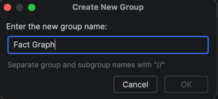
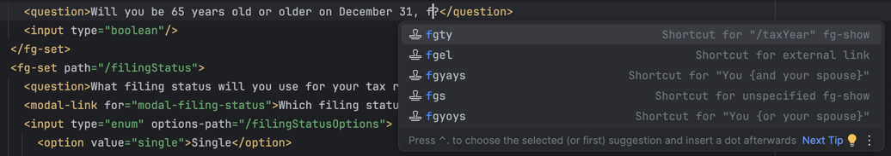
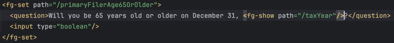

# Live Templates in IntelliJ

This directory contains configurations for templates that allow you to quickly repeat common TWE boilerplate using IntelliJ's [Live Templates](https://www.jetbrains.com/help/idea/using-live-templates.html).

## Import templates

> [!NOTE]
> Live Templates cannot currently be automatically shared as an IntelliJ configuration in version control such that they will be automatically configured when opening this project.
>
> Instead, You must manually import Live Templates.

To import the existing, shared templates in this repository:

1. Open [live-templates.xml](./live-templates.xml), and copy its contents (`CMD + A`, `CMD + C`)
2. If you do not already have a template group set up, add one in `Settings > Editor > Live Templates`
   1. Click on the `+` and select `Template Group`
   2. Name the group however you prefer (e.g. `Fact Graph`), and select `OK`

      

3. With the new template group selected, paste (`CMD + V`) the contents of live-templates.xml to add the preconfigured templates
4. Verify the templates are working by navigating to any applicable file and starting to type the live template's shortcut keys. You will see a list of templates pop up in Intellisense.

   

5. Finish typing the shortcut, or select the one you want and hit `tab` or `enter` to apply the template

   

## Add a new template

To add a new template to this repository:

1. Set up the template in your IntelliJ `Settings > Editor > Live Templates`
2. Verify that it works as intended
3. Highlight and select the template you created and copy it (`CMD + C`). This will copy the template's xml-based configuration.
4. Open [live-templates.xml](./live-templates.xml), and paste (`CMD + V`) it in the file.
5. Open a pull request to add the template for everyone else to use
