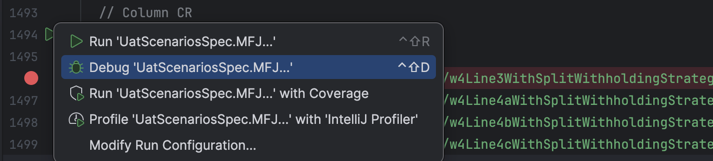

# Debugging UAT Scenarios in IntelliJ

The tests in [UatScenariosSpec.scala](../../../../../src/test/scala/gov/irs/twe/factDictionary/scenarios/UatScenariosSpec.scala) build a fact graph from a column of the UAT spreadsheet and then assert calculated values against it. When an assertion fails, the assertion message only tells you about the one fact that was checked, but the value you actually care about is often somewhere upstream in the fact graph.

This guide shows how to pause a scenario test mid-run with IntelliJ's debugger and use [**Watches**](https://www.jetbrains.com/help/idea/examining-suspended-program.html#watches) to inspect any number of facts at once.

## Debug a single scenario

1. Find the `test("...")` block for the scenario you want to debug.

2. Set a breakpoint at the desired location within the test. We will assume the breakpoint is set anytime after a call to `val scenario = td.scenario`, for simplicity.

3. Click the gutter icon to the left of the `test("...")` line and choose **Debug 'scenario name'**. IntelliJ auto-creates a ScalaTest run configuration scoped to just that test.

   

4. Execution will pause at your breakpoint, and the **Debug** tool window will open.

## Inspect facts with Watches

Watches are user-defined expressions the debugger re-evaluates every time execution pauses. For debugging scenarios, we commonly define watches in the form `scenario.getFact("/some/fact/path")`.

1. In the Debug tool window, open the **Threads & Variables** tab and find the **Watches** section (or the dedicated **Watches** tab, depending on your layout).

2. Click the `+` button to `Add to Watches`.

3. Type a `scenario.getFact(...)` expression. Examples:

   ```scala
   scenario.getFact("/agi")
   scenario.getFact("/taxableIncome")
   scenario.getFact("/standardOrItemizedDeduction")
   ```

   For **collection-scoped facts** (jobs, pensions, social security sources, etc.), use Scala string interpolation with the ID constants that `UatScenariosSpec.scala` already imports:

   ```scala
   scenario.getFact(s"/jobs/#$JOB_1_ID/w4Line4cWithSplitWithholdingStrategy")
   scenario.getFact(s"/jobs/#$JOB_2_ID/w4Line4bWithSplitWithholdingStrategy")
   ```

   The `JOB_1_ID`, `JOB_2_ID`, `JOB_3_ID`, etc. constants come from [`Scenario.scala`](../../../../../src/main/scala/gov/irs/twe/scenarios/Scenario.scala) and are in scope inside any test in this file, so the interpolation resolves the same way it does in the test body.

4. Repeat for every fact you want to monitor.

   


## Tips

- **Step over assertions to watch values change:** Some derived facts depend on `graph.set(...)` calls inside the test body (e.g. `scenario.graph.set("/wantsStandardDeduction", false)`). Step over those lines to see watch values update.
- **Spreadsheet-side comparison:** `scenario.getExpectedSheetValueByFactPath("/agi")` returns the `(sheetRowName, rawSpreadsheetValue)` tuple for a derived fact. Drop it in as a watch when you want to see what the spreadsheet thinks the answer should be next to what the fact graph computed.
- **Reusability:** Watches persist across debug sessions. If you set up watches for debugging a particular set of facts and want to verify them on another scenario, simply debugging a different scenario will retain all of your previously defined Watches in the debug tool window.
